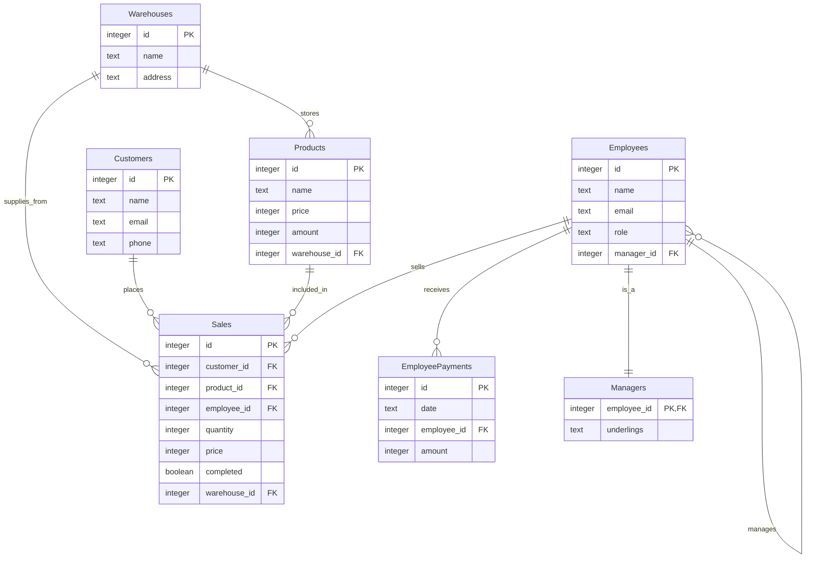

# Term Project Carson Burke

A Basic CRUD application programmed from the ground up using a custom schema, to showcase knowledge of SQL and its usage in websites and applications with middleware.

## Core Entities

- Warehouses: Storage locations for products
- Products: Items sold by the company, each associated with a specific warehouse
- Customers: Clients that purchase products
- Sales: Transaction records linking customers, products, commissinoed employees and warehouses
- Employees: Staff members with info, roles and manager
- Managers: Manager-specific information such as who they oversee
- EmployeePayments: Payroll history for employee compensation

## Getting Started

1. Clone the repository
2. Install dependencies: `sqlite3`
3. Initialize the application using the schema: `sqlite3 data.db < schema.sql`
4. Run the CRUD CLI application: `py app.py`

## Entity-Relationship Diagram (Mermaid.js)

